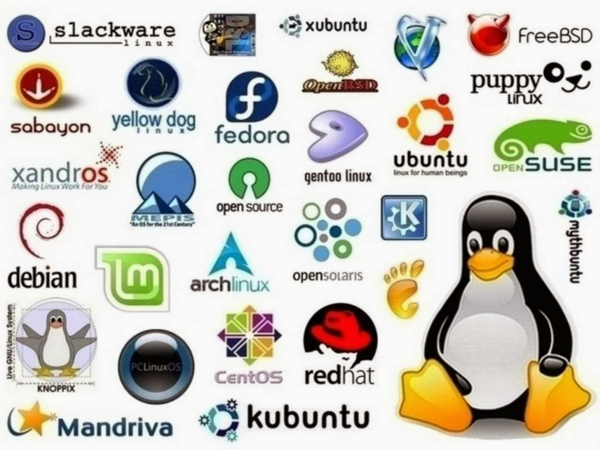

# Aulas - Portfólio Digital de Sistemas Operativos (SO)

Bem-vindo ao repositório do portfólio digital para a disciplina de **Sistemas Operativos (SO)** do curso **TPSI** no **Instituto Superior de Engenharia de Coimbra (ISEC)**, ano letivo **2024/2025**.

Este repositório foi criado para **documentar**, **organizar** e **partilhar** os conteúdos, materiais e exercícios desenvolvidos ao longo do semestre. O objetivo é facilitar o acompanhamento das aulas e manter um histórico bem estruturado do progresso na disciplina.

Imagem retirada de:
> https://universodigital.org/en/gnu-linux-en/

## Estrutura do Portfólio

Cada pasta no repositório representa uma aula da disciplina, com materiais específicos de cada sessão. Dentro de cada pasta, encontrarás:

- **`README.md`**: Um resumo dos temas abordados e principais tópicos discutidos na aula.
- **Material de Aula**: Arquivos PDF, diapositivos ou anotações que suportam o conteúdo apresentado.
- **Exercícios e Projetos**: Arquivos relacionados aos exercícios práticos e atividades de cada aula. Os formatos variam de acordo com a necessidade da atividade (código, diagramas, documentos, etc.).

## Aulas
- **[Aula01/](https://github.com/FilipeJeronimo/Portfolio-SO/tree/main/2025-02%20-%20Fevereiro/21fev)**: ...
- **[Aula02/](https://github.com/FilipeJeronimo/Portfolio-SO/tree/main/2025-02%20-%20Fevereiro/28fev)**: ...
- **[Aula03/](https://github.com/FilipeJeronimo/Portfolio-SO/tree/main/2025-03%20-%20Março/07Mar)**: ...

## Objetivos do Portfólio

Este portfólio foi desenvolvido com os seguintes objetivos:

✅ **Facilitar o Acesso aos Materiais**: Disponibilizar todos os materiais de cada aula num só lugar, com uma estrutura organizada e de fácil navegação.

✅ **Documentar o Progresso**: Manter um registo do desenvolvimento das competências ao longo do curso.

✅ **Colaboração e Feedback**: Permitir que colegas e professores acedam ao portfólio, promovendo colaboração e feedback para aprimorar a compreensão dos temas.

## Tecnologias e Ferramentas Utilizadas

Para a construção e manutenção deste portfólio, utilizamos:

- **Git e GitHub**: Para controlo de versão e armazenamento dos arquivos de forma segura e organizada.
- **GitHub Desktop**: Facilita o controlo de versão e o envio dos arquivos do portfólio.
- **Ferramentas de Edição de Texto e PDF**: Microsoft Word, Google Docs e editores de PDF para criação e edição de documentos.

## Sobre a Disciplina

A disciplina de **Sistemas Operativos (SO)** aborda os conceitos fundamentais sobre o funcionamento dos sistemas operativos modernos. Entre os tópicos estudados estão **gestão de processos e threads**, **gestão de memória**, **sistemas de ficheiros**, **segurança e permissões**, além de conceitos práticos sobre SOs baseados em Linux e Windows.

---

